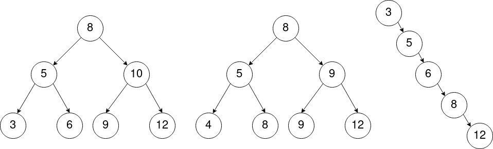

# Exercices - Arbres binaires de recherche

Voici 3 **arbres binaires** :

!!! note "Exercice 1"
    
    1. Parmi ces arbres, pouvez-vous dire lesquels sont des arbres binaires *de recherche* ?
    2. Quelle est l'ordre des *noeuds* lors des parcours *préfixe*, *infixe*, *postfixe* du premier arbre ?
    3. Quel parcours est particulièrement intéressant avec les arbres binaire *de recherche* ? Pourquoi ?

!!! note "Exercice 2"
    Dessinez un **arbre binaire de recherche** :

    1. En ajoutant, en suivant l'ordre, les valeurs suivantes : **14,13,12,11,8,5,4,3,1** 
    Que constatez-vous ?
    2. Re-dessinez cet arbre de manière à obtenir un arbre **équilibré**.
    3. Si on **insère** chaque valeur une par une dans l'arbre, dans quel ordre faut-il les ajouter pour obtenir un arbre équilibré ?
    4. A votre avis, quelle **coût algorithmique** aura la recherche dans le premier arbre que vous avez dessiné ? Dans le deuxième ?