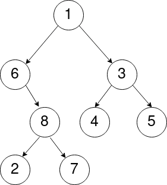
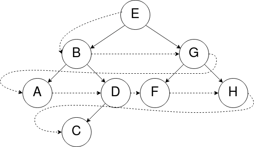

!!! info
	Ces exercices sont également disponibles en format **PDF** : [fiche2_parcours.pdf](fiche2_parcours.pdf){: target="_blank" }

# Exercices - Parcours d'arbres binaires

Il existe plusieurs façons de **parcourir un arbre binaire** (c'est-à-dire de **visiter les nœuds de l'arbre** dans un **ordre** précis), et notamment deux types de **parcours** :

* le parcours en **largeur** d'abord,
* le parcours en **profondeur** d'abord.

## Parcours en profondeur

En l’occurrence, **trois cas particuliers** du **parcours en profondeur** sont à connaître sur les **arbres binaires** : le parcours en **ordre préfixe**, en **ordre infixe** et en **ordre suffixe** (ou *postfixe*).

Ces parcours se définissent **de manière récursive**. Ils consistent à **traiter** la **racine** de l'arbre et à **parcourir récursivement** les **sous-arbres gauche** et **droit** de la racine. Les parcours **préfixe**, **infixe** et **suffixe** se distinguent par l'**ordre** dans lequel sont effectués ces traitements.

### Parcours préfixe, infixe, postfixe

Voici un **arbre binaire** :

<figure markdown>
  { width="85%" }
  <figcaption>Un arbre binaire</figcaption>
</figure>

!!! info "Déroulement *parcours préfixe*"

    *Précondition* : L'arbre n'est pas vide 
    Le `parcours préfixe` se déroule comme suit :
    
    1. On `visite` le **nœud racine** de l'arbre.
    2. On effectue le `parcours préfixe` du **sous-arbre gauche** (s'il est NON vide).
    3. On effectue le `parcours préfixe` du **sous-arbre droit** (s'il est NON vide).

!!! note "Exercice 1"
	En suivant le déroulement précédent, **listez** les valeurs des **nœuds** de l'arbre en *figure 1* visités dans l'**ordre préfixe**.

!!! info "Déroulement *parcours suffixe*"

    *Précondition* : L'arbre n'est pas vide 
    Le `parcours suffixe` se déroule comme suit :
    
    1. On effectue le `parcours suffixe` du **sous-arbre gauche** (s'il est NON vide).
    2. On effectue le `parcours suffixe` du **sous-arbre droit** (s'il est NON vide).
    3. On `visite` le **nœud racine** de l'arbre.

!!! note "Exercice 2"
    En suivant le déroulement précédent, **listez** les valeurs des **nœuds** de l'arbre en *figure 1* visités dans l'**ordre suffixe**.

!!! info "Déroulement *parcours infixe*"

    *Précondition* : L'arbre n'est pas vide 
    Le `parcours infixe` se déroule comme suit :
    
    1. On effectue le `parcours infixe` du **sous-arbre gauche** (s'il est NON vide).
    2. On `visite` le **nœud racine** de l'arbre.
    3. On effectue le `parcours infixe` du **sous-arbre droit** (s'il est NON vide).

!!! note "Exercice 3"
    En suivant le déroulement précédent, **listez** les valeurs des **nœuds** de l'arbre en *figure 1* visités dans l'**ordre infixe**.

!!! note "Exercice 4"

    1. Redessinez l'arbre en *figure 1* en y ajoutant les **nœuds vides** (notés $\emptyset$) et les **arêtes** associées. Vous pouvez les dessiner en pointillés.
    2. Tracez le **contour de l'arbre** (en commençant à gauche de la racine).
    3. Listez les nœuds de l'arbre de trois manière différentes :
        * Une première liste dans laquelle vous ajoutez chaque **nœud** lorsque vous passez **à sa gauche**. Quel est l'ordre de parcours (préfixe, infixe, postfixe) ainsi obtenu ?
        * Une seconde liste dans laquelle vous ajoutez chaque nœud lorsque vous passez **à sa droite**. Quel est l'ordre de parcours (préfixe, infixe, postfixe) ainsi obtenu ?
        * Une troisième liste dans laquelle vous ajoutez chaque nœud lorsque vous passez **en dessous**. Quel est l'ordre de parcours (préfixe, infixe, postfixe) ainsi obtenu ?

## Parcours en largeur

Le **parcours en largeur** consiste à parcourir un arbre **niveau par niveau**. Le **nœud** de *profondeur 0* (ou *1* selon la convention choisie) est d'abord parcouru, puis les **nœuds** de *profondeur 1* (ou *2*), et ainsi de suite.  À chaque niveau, les **nœuds** sont **parcourus de la gauche vers la droite**.

!!! info "Déroulement *parcours en largeur*"

    Le **parcours en largeur** fonctionne donc de la manière suivante :
    
    * On `visite` le **nœud racine**
    * On `visite` les **nœuds fils** du **nœud racine** (d'abord le **fils gauche**, puis le **fils droit**)
    * Puis on `visite` les **nœuds fils** du **fils gauche** du **nœud racine**, puis les **nœuds fils** du **fils droit** du nœud racine
    * Et ainsi de suite...

Par exemple, si l'on parcourt l'arbre suivant **en largeur**, les **nœuds** seront visités dans cet ordre : `[E, B, G, A, D, F, H, C]`

{ width="60%" }

!!! note "Exercice 5"
    **Listez** les valeurs des **nœuds** de l'arbre en *figure 1* visités lors d'un **parcours en largeur**.

!!! note "Exercice 6"
    Si l'on implémentait l'algorithme de **parcours en largeur**, on aurait besoin d'une structure de données permettant d'y stocker à chaque fois les prochains **nœuds à visiter** (qui contiendrait initialement la **racine de l'arbre**), de manière à ce que ***le premier nœud ajouté soit le premier nœud visité***.

    À votre avis, quelle **structure de données linéaire** pourrait-on utiliser pour implémenter le **parcours en largeur** ?