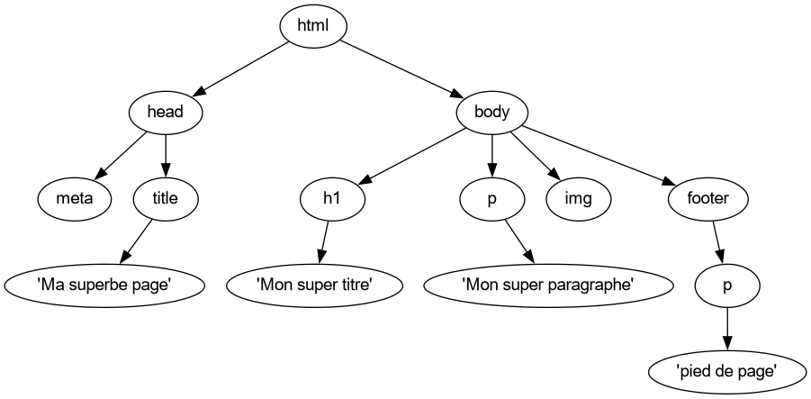

!!! info
	Ces exercices sont également disponibles en format **PDF** : [fiche1_vocabulaire.pdf](fiche1_vocabulaire.pdf)

# Exercices - Vocabulaire sur les arbres
## Dessiner un arbre
### Une arborescence de fichiers

Sur *Linux*, on peut lister récursivement les répertoires et fichiers du système à l'aide de la commande `tree`. Voici un exemple d'arborescence obtenue après exécution de cette commande :

<figure markdown>
  { width="75%" }
  <figcaption>Une arborescence sur Linux</figcaption>
</figure>

!!! note "Question 1"

	Dessinez un arbre représentant cette arborescence, en partant de l'arbre suivant :
    
    { width="25%" }
    
    1. Quelle est la **taille** de cet arbre ?
    2. Combien y a t-il d'**arêtes** dans l'arbre ?
    3. Quelles sont les **feuilles** de l'arbre ?

    En considérant que la **profondeur** de la **racine** est de **1** :

    4. Quelle est la **profondeur** du nœud **D5** ?
    5. Quelle est la **hauteur** de l'arbre ?
    6. Cet arbre est-il un **arbre binaire** ? Pourquoi ?

??? tip "Correction question 1"

	1. La taille est de **11**, car il y a 11 noeuds dans l'arbre.
	2. En sachant que **chaque noeud**, à l'exception du **noeud racine**, possède exactement **une arête** le reliant à son **noeud père**, le nombre d'arêtes d'un arbre est toujours $taille - 1$.
	Ici, le nombre d'arêtes est donc de 11 - 1 = **10**.
	3. Une feuille est un noeud qui n'a **pas de noeuds fils**. Ici, les **feuilles** sont au nombre de **5** : *F2.txt*, *F6*, *F1.txt*, *D5*, *F3.txt*.
	4. La **profondeur** du noeud **D5**, en considérant que la **racine** a une profondeur de **1**, est le nombre de **noeuds** qui le sépare de la racine : Elle est donc ici de **3**.
	5. La **hauteur** d'un arbre est la **plus grande profondeur des feuilles de l'arbre**, ici elle est donc de **4**.
	6. Dans un arbre binaire, un **noeud** ne peut avoir qu'**un, deux ou trois noeuds fils**. Ici, ce n'est pas le cas, l'arbre n'est donc pas un arbre binaire (on dira que c'est un **arbre enraciné**).

### Arbre d'une page HTML

Voici le code HTML d'une page web :

```html
<html>
    <head>
        <meta charset="utf-8">
        <title>Ma superbe page</title>
    </head>
    <body>
        <h1>Mon super titre</h1>
        <p>Mon super paragraphe</p>
        
    </body>
    <footer>
        <p>Un pied de page</p>
    </footer>
</html>
```

L'arbre (appelé *arbre DOM*) représentant ce code HTML est le suivant :

<figure markdown>
  
  <figcaption>Arbre DOM d'une page HTML</figcaption>
</figure>

!!! note "Question 2"

	À votre tour, dessinez l'arbre DOM représentant la page HTML suivante :

    ```html
    <html>
        <head>
            <meta charset="utf-8">
            <link href="main.css" rel="stylesheet">
            <title>Pokémons</title>
        </head>
        <body>
            <section>
                <h1>Types des pokémons</h1>
                <ul>
                    <li>FEU</li>
                    <li>FOUDRE</li>
                    <li>EAU</li>
                    <li>HERBE</li>
                    <li>NORMAL</li>
                </ul>
            </section>
        </body>
    </html>
    ```

    1. Quelle est la **taille** de l'arbre obtenu ?
    2. Quelle est la **hauteur** de l'arbre obtenu :
       1. Si la profondeur de la racine est de **0** ?
       2. Si la profondeur de la racine est de **1** ?
    3. Quels **types d'éléments** représentent les **feuilles** de l'arbre ?
    4. Si les **nœuds** de l'arbre étaient des instances d'une classe `Noeud` caractérisés par une **étiquette** (`html`, `body`, etc) et des **données**, quelles pourraient être ces données ? (voir la balise `meta` ou `link` du code ci-dessus.)

??? tip "Correction question 2"

	Voici l'arbre obtenu à partir de ce code HTML :
	
	
	1. La taille est de **21** car il y a *21 noeuds** dans l'arbre.
	2. La hauteur est la **profondeur des feuilles les plus éloignées de la racine**, elle est de **5** si la **profondeur** de la **racine** vaut **0**, et de **6** si la **profondeur** de la **racine** vaut **1**.
	3. Les **feuilles de l'arbre** représentent :
		- le **texte brut** contenu à l'intérieur des balises ouvrantes et fermantes,
		- Les balises **autofermantes** (comme la balise `meta`, `link`, etc.)
	4. Pour représenter correctement une page web, on aurait besoin d'un objet permettant de stocker **les attributs associés aux balises**. Par exemple ici, les attributs de la balise `link` sont `href` (qui vaut `main.css`, un fichier *CSS*) et `rel` (qui vaut `stylesheet`, indiquant que la ressource est une feuille de style CSS). En Python, on pourrait imaginer par exemple de stocker ces attributs dans un **dictionnaire**.

### Arbre d'une expression arithmétique

Voici un **arbre binaire** représentant l'expression arithmétique $(6 + 9) / 3$ :

{ width="40%" }

!!! note "Question 3"
    À votre tour, dessinez l'**arbre binaire** correspondant à l'expression $\frac{5*8}{30-(8*3)}$.

    1. Pour **quels opérateurs** le positionnement (gauche, droit) des opérandes a une importance ? Pourquoi ?
    2. Quelle est la **taille** de l'arbre obtenu ?
    3. Quelles sont les **feuilles** de l'arbre ? Quelle remarque pouvez-vous faire ?

    <br/>
    En considérant que la **profondeur** de la **racine** est de **0** :

    3. Quelle est la **profondeur** de la feuille **la moins éloignée** de la **racine** ?
    4. Quelle est la **hauteur** de l'arbre ?

## Encadrement de la hauteur

Pour l'exercice suivant, on considérera que la profondeur de la racine d'un arbre est de **1**.
Voici deux **arbres binaires** :

{ width="60%" }

!!! note "Question 4"
    1. Parmi ces deux arbres, lequel est un arbre **filiforme** ? Un arbre **complet** ?
    2. À quelle autre structure de données s'apparente un **arbre filiforme** ? Pourquoi ?
    3. Quelle est la **taille** de ces deux arbres ?
    4. Quelles sont toutes les **hauteurs** possibles pour une **taille** $n = 5$ ?
    5. Établissez une relation entre la **taille d'un arbre** notée $n$ et la **hauteur de cet arbre** notée $h$, dans le cas où l'arbre est **filiforme**.
    6. 
		1. Complétez l'arbre **B** de manière à obtenir un **arbre parfait**.
		2. Combien y a t-il de nœuds de **profondeur 1, 2, 3 et 4** ?
		3. Établissez une relation entre le **nombre de nœuds** à une **certaine profondeur**, noté $n_{p}$, en fonction de cette **profondeur**, notée $p$.
		3. En déduire une expression calculant la **taille** $n$ (nombre de **nœuds**) d'un **arbre parfait** en fonction de sa **hauteur** $h$.
    7. Enfin, proposez un encadrement de la **hauteur d'un arbre** en fonction de la **taille** $n$.

## Dénombrement d'arbres binaires

!!! note "Question 5"
    Dessinez et dénombrez tous les **arbres binaires** possibles :

    * pour une taille $n = 1$,
    * pour une taille $n = 2$,
    * pour une taille $n = 3$,
    * pour une taille $n = 4$

    Sans les dessiner et en vous aidant des réponses précédentes, déterminez le **nombre d'arbres** de taille $n = 5$.