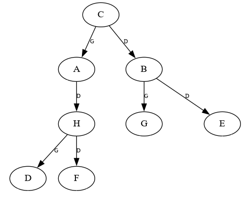

# Implémentation d'un arbre binaire

Il y a de nombreuses manières d'implémenter un **arbre binaire**.

Dans cette partie, on proposera une manière parmi d'autres d'implémenter cette structure de données. Pour vous entraîner sur d'autres implémentations, voir la partie *exercices*.

En langage *Python*, on ne peut pas avoir plusieurs **constructeurs** dans une classe.<br />
On aura donc **un seul constucteur** pouvant être appelé de **deux façons différentes** :

* `Arbre()` : création d'un **arbre binaire vide**, les attributs `racine`, `gauche` et `droite` seront automatiquement affectés à `None`.
* `Arbre(racine, gauche, droite)` : création d'un **arbre binaire non vide**, dont la `racine` est la **valeur** (l'*étiquette*) du **noeud racine**, et `gauche` et `droite` sont également de type `Arbre`.

*Note* : Une **feuille** est donc une instance  de `Arbre` dont le **sous-arbre gauche** et le **sous-arbre droit** sont des **arbres vides**.

!!! success "À télécharger"
    Récupérez les fichiers suivants :

    * [arbre_binaire.py](src/arbre_binaire.py){: target="_blank" } - Classe `Arbre` à compléter représentant un **arbre binaire**.
    * [dessin.py](src/dessin.py){: target="_blank" } - Quelques fonctions annexes utilisées pour dessiner un arbre avec le module `Graphviz`. (Vous n'avez pas besoin d'ouvrir ou de modifier ce fichier.)
    
    Si vous utilisez les **machines du *lycée***:
    
    * [windows_graphviz.zip](src/windows_graphviz.zip){: target="_blank" } - Décompressez l'archive **dans le répertoire où se trouvent vos fichiers Python**. Vous devez avoir `arbre_binaire.py`, `dessin.py` et un dossier `Graphviz` au même endroit.<br />Contient les exécutables de *Graphviz*.

??? note "Installation de *Graphviz* sur votre machine personnelle"
	Pour utiliser la fonction `dessiner`, le module `Graphviz` et les exécutables associés doivent être installés sur votre machine. Voici comment procéder.
	
	<u>**Étape 1**</u> - **Installer le module Graphviz**
	
	**Méthode 1** :
	
	Dans **Thonny**, allez dans l'onglet "Outils", puis "Gérer les paquets". Recherchez "graphviz", puis cliquez sur le bouton ***Installer***.
	
	**Méthode 2** :
	
	Ouvrez l'**invite de commande Windows** (ou le *terminal* si vous utilisez *Linux*), puis exécutez simplement la commande suivante :
	
	```
	pip install graphviz
	```
	
	<u>**Étape 2**</u> - **Installer les exécutables**
	
	Si vous êtes sur **Windows**, [cliquez ici](https://graphviz.org/download/#windows){: target="_blank" } puis **téléchargez et installez** la **dernière version** de *Graphviz* (choisissez l'`EXE Installer` correspondant à la version de votre système d'exploitation, *32 bits* ou *64 bits*. Si vous avez un doute, choisissez la version *32 bits* ou lisez [cet article](https://lecrabeinfo.net/32-ou-64-bits-comment-savoir.html#windows-32-bits-ou-64-bits){: target="_blank" } pour connaître la version de votre système.)
	
	Si vous êtes sur **Linux**, [cliquez ici](https://graphviz.org/download/#linux){: target="_blank" } puis installez le paquet `graphviz` en exécutant dans le *terminal* la commande associée à votre distribution (*Ubuntu*, *Fedora*, etc.).
	
	Si vous êtes sur **macOS**, [cliquez ici](https://graphviz.org/download/#mac){: target="_blank" } puis exécutez l'une des commandes indiquées.

## Méthodes de la classe

Intéressons-nous d'abord aux **méthodes** de notre classe, de manière à définir les **opérations de base** pouvant être effectuées sur notre arbre.

```python
''' Classe implémentant un Arbre Binaire. '''

class Arbre:
    def __init__(self, valeur=None, gauche=None, droite=None):
        ''' Crée un nouvel arbre binaire.
        :param valeur: (int|str) La valeur du noeud racine, soit un entier, soit une chaîne de caractères
        :param gauche: (Arbre) Le sous-arbre binaire gauche (None pour arbre binaire vide)
        :param droite: (Arbre) Le sous-arbre binaire droit (None pour arbre binaire vide)
        :CU: Si valeur est à None, gauche et droite doivent être également à None (cas de l'arbre vide),
        sinon, gauche et droite doivent être de type Arbre. '''
        
        assert (valeur == None and gauche == None and droite == None) or \
               (type(valeur) in (int, str) and type(gauche) == Arbre and type(droite) == Arbre)
        
        self.v = valeur
        self.g = gauche
        self.d = droite

    def est_vide(self):
        ''' Renvoie True si l'arbre binaire est vide, False s'il ne l'est pas. '''
        pass
    
    def racine(self):
        ''' Renvoie le Noeud racine de l'arbre binaire.
        :CU: L'arbre n'est PAS vide '''
        pass
    
    def valeur_racine(self):
        ''' Renvoie la valeur de la racine de l'arbre binaire.
        :CU: L'arbre n'est PAS vide'''
        pass
    
    def gauche(self):
        ''' Renvoie le sous-arbre gauche de l'arbre binaire.
        :CU: L'arbre n'est PAS vide'''
        pass
    
    def droite(self):
        ''' Renvoie le sous-arbre droit de l'arbre binaire.
        :CU: L'arbre n'est PAS vide'''
        pass
    
    def est_feuille(self):
        ''' Renvoie True si l'arbre binaire est une feuille, False s'il ne l'est pas.
        :CU: L'arbre n'est PAS vide'''
        pass
```
!!! warning "Important"
	Dans cette implémentation, on n'utilise pas de classe `Noeud` pour représenter les **noeuds** de l'arbre (ce qui diffère du *type abstrait*). On considère que le **noeud racine** d'un arbre est l'**arbre lui-même**. La méthode nommée `racine` renverra donc simplement **l'adresse de l'instance de la classe `Arbre`**.

!!! note "À faire"
	Complétez le corps de chaque méthode de la classe `Arbre`.
	
??? tip "Solution"
	```python
    ''' Classe implémentant un Arbre Binaire. '''

    class Arbre:
        def __init__(self, valeur=None, gauche=None, droite=None):
            ''' Crée un nouvel arbre binaire.
            :param valeur: (int|str) La valeur du noeud racine, soit un entier, soit une chaîne de caractères
            :param gauche: (Arbre) Le sous-arbre binaire gauche (None pour arbre binaire vide)
            :param droite: (Arbre) Le sous-arbre binaire droit (None pour arbre binaire vide)
            :CU: Si valeur est à None, gauche et droite doivent être également à None (cas de l'arbre vide),
            sinon, gauche et droite doivent être de type Arbre. '''
    
            assert (valeur == None and gauche == None and droite == None) or \
                   (type(valeur) in (int, str) and type(gauche) == Arbre and type(droite) == Arbre)
    
            self.v = valeur
            self.g = gauche
            self.d = droite
    
        def est_vide(self):
            ''' Renvoie True si l'arbre binaire est vide, False s'il ne l'est pas. '''
            return self.v == None
    
        def racine(self):
            ''' Renvoie le Noeud racine de l'arbre binaire.
            :CU: L'arbre n'est PAS vide '''
            return self
    
        def valeur_racine(self):
            ''' Renvoie la valeur de la racine de l'arbre binaire.
            :CU: L'arbre n'est PAS vide'''
            return self.v
    
        def gauche(self):
            ''' Renvoie le sous-arbre gauche de l'arbre binaire.
            :CU: L'arbre n'est PAS vide'''
            return self.g
    
        def droite(self):
            ''' Renvoie le sous-arbre droit de l'arbre binaire.
            :CU: L'arbre n'est PAS vide'''
            return self.d
    
        def est_feuille(self):
            ''' Renvoie True si l'arbre binaire est une feuille, False s'il ne l'est pas.
            :CU: L'arbre n'est PAS vide'''
            return self.gauche().est_vide() and self.droite().est_vide()
    ```

## Création d'un nouvel arbre

Essayons de créer l'arbre suivant en utilisant notre classe `Arbre` :

<figure markdown>
  { width="350px" }
  <figcaption>Arbre binaire créé avec la classe Arbre</figcaption>
</figure>

!!! note "Note"
	L'affichage avec `Graphviz` ne permettant pas toujours de bien distinguer visuellement les sous-arbres gauches des sous-arbres droits, on a ajouté l'information `G` ou `D` sur chaque **arête**, indiquant respectivement qu'il s'agit du **sous-arbre gauche** ou du **sous-arbre droit**.

Voici une instruction permettant de **créer cet arbre** à l'aide de notre classe `Arbre` et de le stocker dans une variable `a` :

```python
    ab = Arbre('C',
              Arbre('A',
                    Arbre(),
                    Arbre('H',
                          Arbre('D', Arbre(), Arbre()),
                          Arbre('F', Arbre(), Arbre())
                          )
                    ),
              Arbre('B',
                    Arbre('G', Arbre(), Arbre()),
                    Arbre('E', Arbre(), Arbre())
                    )
              )
```

Bien sûr, on aurait pu l'écrire sur une seule ligne :

```python
    ab = Arbre('C', Arbre('A', Arbre(), Arbre('H', Arbre('D', Arbre(), Arbre()), Arbre('F', Arbre(), Arbre()))), Arbre('B', Arbre('G', Arbre(), Arbre()), Arbre('E', Arbre(), Arbre())))
```

On aurait également pu créer plusieurs variables de manière à décomposer l'**arbre** :

```python
    # Création des feuilles
    fd = Arbre('D', Arbre(), Arbre())
    ff = Arbre('F', Arbre(), Arbre())
    fg = Arbre('G', Arbre(), Arbre())
    fe = Arbre('E', Arbre(), Arbre())
    # Création des sous-arbres
    sah = Arbre('H', fd, ff)
    sab = Arbre('B', fg, fe)
    saa = Arbre('A', Arbre(), sah)
    # Création de l'arbre final
    ab = Arbre('C', saa, sab)
```

Enfin, pour **dessiner** cet arbre, on peut utiliser la fonction **dessiner** importée depuis `dessin.py` :

```python
	dessiner(ab)
```

Si l'on souhaite accéder par exemple au **noeud ayant pour valeur B**, qui est équivalent à l'**arbre** dont `valeur_racine() == 'B'`, on utilisera l'instruction :

```python
	ab.droite().racine()
```
ou simplement

```python
	ab.droite()
```

et si on veut récupérer la **valeur** de ce **noeud** :

```python
	ab.droite().valeur_racine()
```

!!! note "À faire"
	Comment récupérer la **feuille** ayant pour valeur **D** ?
	
??? tip "Solution"
	```python
        ab.gauche().droite().gauche().racine()
	```
	ou simplement
	
	```python
	    ab.gauche().droite().gauche()
	```
	
	et pour récupérer la **valeur** qu'elle contient :
	
	```python
	    ab.gauche().droite().gauche().valeur_racine()
	```

## Quelques mesures sur les arbres

!!! warning "Important"
	Pour les mesures suivantes, on considèrera que la **profondeur du noeud racine** est de **0**. Ainsi, on considèrera que la **hauteur** de l'**arbre vide** est de **-1**. Il s'agit d'un choix arbitraire, on aurait très bien pu choisir une profondeur de 1 pour le noeud racine (auquel cas l'arbre vide serait de hauteur 0).

On rappelle que pour écrire des fonctions de manière **récursive**, vous devez toujours distinguer :

* au moins un **cas de base** (condition d'arrêt), qui ici peut être par exemple le cas où l'**arbre est vide** ou encore le cas où l'**arbre est une feuille**. Un cas de base est un cas **non récursif**, pour lequel la valeur renvoyée par la fonction est directement définie.
* au moins un **cas général**, ou **cas récursif**, c'est-à-dire un cas dans lequel la fonction est appelée récursivement et où le résultat renvoyé est calculé en utilisant le résultat du (ou des) appel(s) récursif(s). À chaque appel récursif, la valeur d'au moins un des
paramètres de la fonction doit changer, de manière à **converger vers le cas de base**.

!!! note "À faire"
	Complétez les fonctions `taille`, `hauteur`, `nb_feuilles` et `est_present`. Ces fonctions doivent être écrites de manière **récursive**.

??? question "Indice pour la fonction `taille`"
	Pour écrire cette fonction, qui doit fonctionner autant sur un **arbre vide** que sur un **arbre non vide**, il convient d'abord de déterminer un **cas de base**, c'est-à-dire un cas **non récursif** de manière à ce que l'algorithme s'arrête à un moment donné.<br />
	Sur quel type d'arbres la fonction `taille` renverra **toujours la même valeur** ?
	
	- Si l'on cherche la **taille** d'un **arbre vide**, on obtiendra **toujours 0** car un arbre vide ne contient **pas de noeuds**. C'est donc là notre **cas de base**.
	
	Ensuite, il faut détermine un cas général, c'est-à-dire un cas où l'on effectue un ou plusieurs appels récursifs à `taille`.
	
	- Si l'on cherche la *taille* d'un **arbre non vide**, c'est-à-dire d'un arbre constitué d'un **noeud racine**, d'un **sous-arbre gauche** et d'un **sous-arbre droit**, on peut alors établir que la **taille de l'arbre** correspond à *1 (on compte le noeud racine) + la taille du sous-arbre gauche + la taille du sous-arbre droit*.<br />Au fur et à mesure des appels récursifs, on convergera vers le cas où l'arbre est vide, et donc la fonction finira par se terminer.
	
	Maintenant que l'on a déterminé ces deux cas en français, il ne reste plus qu'à les retranscrire en Python.

??? question "Indice pour la fonction `hauteur`"
    Cette fonction est assez proche de la fonction `taille`.
    On doit pouvoir déterminer la **hauteur** d'un arbre vide ou non.

    La **profondeur du noeud racine** est de **0**.
    
    - On considèrera que la **hauteur d'un arbre vide** est **toujours** de **-1**, ce sera donc le **cas de base**.
    - Pour le **cas général** (arbre *non vide*), il faut compter la **racine**, donc ajouter **1** à la hauteur de l'arbre, puis y ajouter **la plus grande hauteur entre celle du sous-arbre gauche et celle du sous-arbre droit** (appels récursifs).
    
    *Note* : La fonction Python `max` permet de déterminer la plus grande valeur entière parmi plusieurs valeurs.

??? tip "Solutions"
	```python
    def taille(ab: Arbre) -> int:
    ''' Renvoie la taille d'un arbre. '''
    
    if ab.est_vide():
        return 0
    else:
        return 1 + taille(ab.gauche()) + taille(ab.droite())

	def hauteur(ab: Arbre) -> int:
    ''' Renvoie la hauteur d'un arbre. '''

        if ab.est_vide():
            return -1
        else:
            return 1 + max(hauteur(ab.gauche()), hauteur(ab.droite()))
    
    def nb_feuilles(ab: Arbre) -> int:
        ''' Renvoie le nombre de feuilles que contient un arbre binaire. '''
        
        if ab.est_vide():
            return 0
        elif ab.est_feuille():
            return 1
        else:
            return nb_feuilles(ab.gauche()) + nb_feuilles(ab.droite())
    
    def est_present(ab: Arbre, el: int|str) -> bool:
        ''' Renvoie True si un noeud contenant l'élément el est présent dans l'arbre, False sinon. '''
        
        if ab.est_vide():
            return False
        elif ab.valeur_racine() == el:
            return True
        else:
            return est_present(ab.gauche()) or est_present(ab.droite())
    ```

## Parcours d'arbres

### Parcours en profondeur

On rappelle le déroulement des parcours **préfixe**, **infixe** et **suffixe** (ou *postfixe*). Dans notre implémentation, on se contentera d'**afficher** les **noeuds visités** :

!!! info "Déroulement *parcours préfixe*"

    *Précondition* : L'arbre n'est pas vide<br />
    Le `parcours_préfixe` se déroule comme suit :
    
    1. On `affiche` le **nœud racine** de l'arbre.
    2. On effectue le `parcours préfixe` du **sous-arbre gauche** (s'il est NON vide).
    3. On effectue le `parcours préfixe` du **sous-arbre droit** (s'il est NON vide).

!!! info "Déroulement *parcours suffixe*"

    *Précondition* : L'arbre n'est pas vide<br />
    Le `parcours_suffixe` se déroule comme suit :
    
    1. On effectue le `parcours suffixe` du **sous-arbre gauche** (s'il est NON vide).
    2. On effectue le `parcours suffixe` du **sous-arbre droit** (s'il est NON vide).
    3. On `affiche` le **nœud racine** de l'arbre.


!!! info "Déroulement *parcours infixe*"

    *Précondition* : L'arbre n'est pas vide<br />
    Le `parcours_infixe` se déroule comme suit :
    
    1. On effectue le `parcours infixe` du **sous-arbre gauche** (s'il est NON vide).
    2. On `affiche` le **nœud racine** de l'arbre.
    3. On effectue le `parcours infixe` du **sous-arbre droit** (s'il est NON vide).

!!! note "À faire"
	Implémentez les algorithmes de parcours en profondeur **préfixe**, **infixe** et **postfixe** de manière **récursive**.
	
??? tip "Solution"
	À venir...
	
### Parcours en largeur

Contrairement aux algorithmes de **parcours en profondeur**, on implémentera le **parcours en largeur** de manière **itérative** et non récursive.

On utilisera une structure de **file** pour stocker les **noeuds à visiter**, qu'on choisira de représenter par une *liste Python*. Les opérations sur cette file sont les suivantes :

* `file.pop(0)` : défiler (récupérer le premier élément de la file et le retirer de la file),
* `file.append(element)` : enfiler (ajouter un élément à la fin de la file).

Voici le déroulement du **parcours en largeur** :

!!! info "Déroulement *parcours en largeur*"
    *Précondition* : L'arbre n'est pas vide<br />
    Le `parcours_en_largeur` se déroule comme suit :
    
    1. On `crée` une **nouvelle file vide**.
    2. On `enfile` dedans le **noeud racine** de l'arbre (qui est, dans notre implémentation, équivalent à l'arbre lui-même).
    3. *TANT QUE* la **file** n'est **PAS vide** :
    	1. On `défile` la **file** et on stocke le **noeud récupéré** dans une variable.
    	2. On `affiche` la **valeur du noeud récupéré**.
    	3. Si le **sous-arbre gauche** à ce **noeud** n'est **PAS vide**, on l'`enfile` dans la **file**.
    	4. Si le **sous-arbre droit** à ce **noeud** n'est **PAS vide**, on l'`enfile` dans la **file**.

!!! note "À faire"
	Implémentez l'algorithme de parcours en largeur.
	
??? tip "Solution"
	À venir...