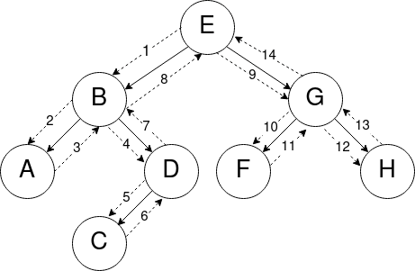

# Parcours d'arbres

**Définition** : Un **parcours d'arbre** est un type d'**algorithme** consistant à **visiter les noeuds** d'un arbre en suivant un certain **ordre**.

Pourquoi parcourir ?
* Rechercher si un arbre contient une valeur particulière.
* Compter les noeuds qui contiennent une valeur donnée.
* etc.

Il existe deux façons de parcourir un arbre :
* le **parcours en profondeur**
* le **parcours en largeur**

Voici un **arbre binaire** que l'on souhaite **parcourir** :

## Le parcours en largeur d'abord

Le **parcours en largeur** consiste à **parcourir l'arbre niveau par niveau**. Les **noeuds** de **niveau 0** sont sont d'abord parcourus, puis les **noeuds** de **niveau 1**, et ainsi de suite. 
Dans **chaque niveau**, les **noeuds sont parcourus de gauche à droite**.

Sur l'arbre ci-dessous : `[E, B, G, A, D, F, H, C]`

## Le parcours en profondeur d'abord

Le **parcours en profondeur** d'un **arbre** est un type de parcours d'arbres qui consiste à traiter **la racine** de l'arbre, et à parcourir récursivement les **sous-arbres gauche** et **droit** de la racine.

Les parcours **préfixe**, **infixe** et **suffixe** (également appelé *postfixe*) se distinguent par l'ordre dans lequel sont effectués ces traitements.

### Parcours préfixe - (Racine-Gauche-Droite)

Dans le parcours **préfixe**, la **racine** est traitée **avant** les appels récursifs sur le **sous-arbre gauche**, puis sur le **sous-arbre droit**. 
*En se "baladant" autour de l'arbre (ordre de visite des noeuds en pointillés), on liste chaque sommet la **première** fois qu’on le rencontre dans la balade.*

Sur l'arbre ci-dessous : `[E, B, A, D, C, G, F, H]`

### Parcours suffixe ou postfixe - (Gauche-Droite-Racine)

Dans le parcours **suffixe** (ou postfixe), la **racine** est traitée **après** les appels récursifs sur le **sous-arbre gauche** puis sur le **sous-arbre droit**. 
*En se "baladant" autour de l'arbre, on liste chaque sommet la **dernière** fois qu’on le rencontre dans la balade.*

Sur l'arbre ci-dessous : `[A, C, D, B, F, H, G, E]`

### Parcours infixe - (Gauche-Racine-Droite)

Dans le parcours **infixe**, le traitement de la **racine** est effectué **entre les appels** sur les **sous-arbres gauche** et **droit**. 
*En se "baladant" autour de l'arbre,  on liste chaque sommet ayant un fils gauche la **seconde fois** qu’on le voit et chaque sommet sans fils gauche la **première fois** qu’on le voit.*

Sur l'arbre ci-dessous : `[A, B, C, D, E, F, G, H]`

### Autre méthode

On peut également retrouver visuellement les trois parcours **préfixe**, **infixe** et **postfixe** en ajoutant les sous-arbres vides (et arêtes associées) au dessin d'un arbre binaire. Si on trace à présent le contour de l'arbre :

* l'ordre **préfixe** est obtenu en listant les **noeuds** lorsque l'on passe à leur *gauche*,
* l'ordre **suffixe** est obtenu en listant les **noeuds** lorsque l'on passe à leur *droite*,
* l'ordre **infixe** est obtenu en listant les **noeuds** lorsque l'on passe en *dessous*.

Pour vous entraîner : voir [cette fiche d'exercices](fiche2_parcours.pdf).