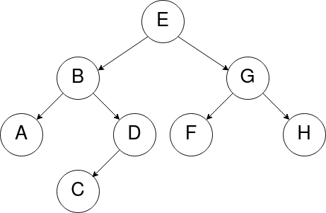

# Parcours d'arbres

**Définition** : Un **parcours d'arbre** est un type d'**algorithme** consistant à **visiter les noeuds** d'un arbre en suivant un certain **ordre**.

Pourquoi parcourir ?

* Rechercher si un arbre contient une valeur particulière.
* Compter les noeuds qui contiennent une valeur donnée.
* etc.

Il existe deux façons de parcourir un arbre :

* le **parcours en profondeur**
* le **parcours en largeur**

Voici un **arbre binaire** que l'on souhaite **parcourir** :

{ width="55%" }

## Le parcours en largeur d'abord

Le **parcours en largeur** consiste à **parcourir l'arbre niveau par niveau**. Le **noeud** de **niveau** (ou *profondeur*) **0** (ou **1** selon la convention choisie pour la *profondeur*), c'est-à-dire le **noeud racine**, est d'abord parcouru, puis les **noeuds** de **niveau 1** (ou **2**), et ainsi de suite. 
À **chaque niveau**, les **noeuds sont parcourus de gauche à droite**.

_Note : On peut parler de parcours en largeur "d'abord", car même si le parcours est d'abord effectué en largeur, l'arbre est bien sûr ensuite visité en profondeur (on visite les noeuds d'un niveau de l'arbre, puis on passe au niveau suivant, etc.)_

Sur l'arbre ci-dessous : `[E, B, G, A, D, F, H, C]`

{ width="55%" }

### Déroulement du parcours en largeur

{ width="55%" }

Initialement, on a deux listes : 
`à visiter = [E]` 
`visités = []`

On visite **E** (on le retire de la liste des **noeuds à visiter** et on l'ajoute dans celle des **noeuds visités**), puis on ajoute ses **noeuds fils** (d'abord **gauche**, puis **droit**) à la fin des **noeuds à visiter**. 
`à visiter = [B, G]` 
`visités = [E]`

On visite le premier noeud **B** de la liste `à visiter` (on l'ajoute à la fin de la liste des **noeuds visités**), puis on ajoute ses **noeuds fils** à la fin de la liste des **noeuds à visiter** : 
`à visiter = [G, A, D]` 
`visités = [E, B]`

On continue avec le noeud **G** : 
`à visiter = [A, D, F, H]` 
`visités = [E, B, G]`

On continue avec le noeud **A** (qui n'a pas de fils, donc on ajoute rien dans les noeuds à visiter) : 
`à visiter = [D, F, H]` 
`visités = [E, B, G, A]`

Et ainsi de suite... 
`à visiter = [F, H, C]` 
`visités = [E, B, G, A, D]`

`à visiter = [H, C]` 
`visités = [E, B, G, A, D, F]`

`à visiter = [C]` 
`visités = [E, B, G, A, D, F, H]`

`à visiter = []` 
`visités = [E, B, G, A, D, F, H, C]`

!!! note "Note"

	Les **premiers noeuds ajoutés** dans `à visiter` sont les **premiers noeuds visités**. Si l'on implémentait cet algorithme, on pourrait donc utiliser une **structure de <u>file</u>**, car on ajoute les noeuds à la fin, et on les retire au début.

## Le parcours en profondeur d'abord

Le **parcours en profondeur** d'un **arbre** est un type de parcours d'arbres qui consiste à traiter **la racine** de l'arbre, et à parcourir récursivement les **sous-arbres gauche** et **droit** de la racine.

Les parcours **préfixe**, **infixe** et **suffixe** (également appelé *postfixe*) se distinguent par l'ordre dans lequel sont effectués ces traitements.

### Parcours préfixe - (**Racine**-Gauche-Droite)

Dans le parcours **préfixe**, la **racine** est traitée **avant** les appels récursifs sur le **sous-arbre gauche**, puis sur le **sous-arbre droit**.

!!! note "Déroulement du parcours préfixe"

    **Précondition** : L’arbre n’est pas vide 
    Le parcours préfixe se déroule comme suit :
    
    1. On `visite` le **noeud racine** de l’arbre.
    2. On effectue le `parcours préfixe` du **sous-arbre gauche** (s’il est NON vide).
    3. On effectue le `parcours préfixe` du **sous-arbre droit** (s’il est NON vide).

(La fonction `visite` reste à définir, cela pourrait être un simple affichage.)

_Une technique visuelle : En se "baladant" autour de l'arbre (ordre de visite des noeuds en pointillés), on liste chaque noeud la **première fois** qu’on le rencontre dans la balade._

Sur l'arbre ci-dessous : `[E, B, A, D, C, G, F, H]`

{ width="55%" }

### Parcours suffixe ou postfixe - (Gauche-Droite-**Racine**)

Dans le parcours **suffixe** (ou postfixe), la **racine** est traitée **après** les appels récursifs sur le **sous-arbre gauche** puis sur le **sous-arbre droit**.

!!! note "Déroulement du parcours suffixe"

    **Précondition** : L’arbre n’est pas vide 
    Le parcours suffixe se déroule comme suit :
    
    1. On effectue le `parcours suffixe` du **sous-arbre gauche** (s’il est NON vide).
    2. On effectue le `parcours suffixe` du **sous-arbre droit** (s’il est NON vide).
    3. On `visite` le **noeud racine** de l’arbre.

_Une technique visuelle : En se "baladant" autour de l'arbre, on liste chaque noeud la **dernière fois** qu’on le rencontre dans la balade._

Sur l'arbre ci-dessous : `[A, C, D, B, F, H, G, E]`

{ width="55%" }

### Parcours infixe - (Gauche-**Racine**-Droite)

Dans le parcours **infixe**, le traitement de la **racine** est effectué **entre les appels** sur les **sous-arbres gauche** et **droit**.

!!! note "Déroulement du parcours infixe"

    **Précondition** : L’arbre n’est pas vide 
    Le parcours infixe se déroule comme suit :
    
    1. On effectue le `parcours infixe` du **sous-arbre gauche** (s’il est NON vide).
    2. On `visite` le **noeud racine** de l’arbre.
    3. On effectue le `parcours infixe` du **sous-arbre droit** (s’il est NON vide).

_Une technique visuelle : En se "baladant" autour de l'arbre, on liste chaque noeud ayant un fils gauche la **seconde fois** qu’on le voit et chaque noeud sans fils gauche la **première fois** qu’on le voit._

Sur l'arbre ci-dessous : `[A, B, C, D, E, F, G, H]`

{ width="55%" }

### Autre méthode

On peut également retrouver visuellement les trois parcours **préfixe**, **infixe** et **postfixe** en ajoutant les sous-arbres vides (et arêtes associées) au dessin d'un arbre binaire. Si on trace à présent le contour de l'arbre :

* l'ordre **préfixe** est obtenu en listant les **noeuds** lorsque l'on passe à leur *gauche*,
* l'ordre **suffixe** est obtenu en listant les **noeuds** lorsque l'on passe à leur *droite*,
* l'ordre **infixe** est obtenu en listant les **noeuds** lorsque l'on passe en *dessous*.

Pour vous entraîner : voir [cette fiche d'exercices](fiche2_parcours.pdf).