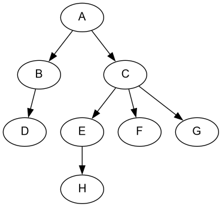
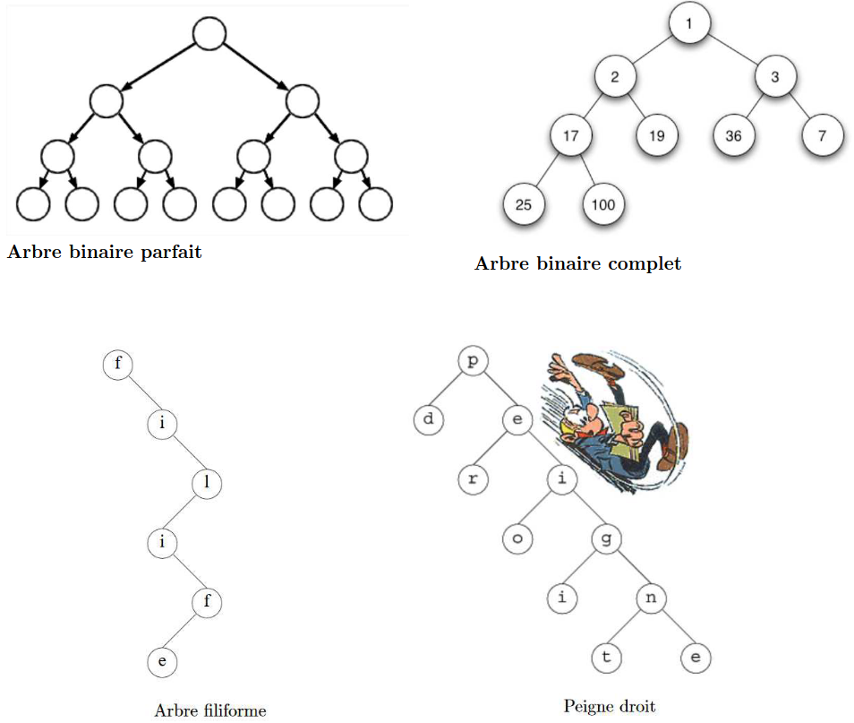

# Arbres : définitions et vocabulaire

## Une structure hiérarchique ?

**Exemple** : La **hiérarchie** (organigramme) d'une entreprise :


## Les arbres, pour quoi faire ?

**Exemple 1** : Lorsque l'interpréteur **Python** lit un programme, il crée d'abord un **arbre syntaxique** utilisant la grammaire du langage. On ne pourrait en effet pas stocker ces données dans une structure linéaire sans y perdre la structuration du programme.

```python
def produit(a: int, b: int) -> int:
    s = 0
    for i in range(b):
        s = s + a
    return s
```


**Exemple 2** : Arbre d'une page HTML

```html
<html>
    <head>
        <meta charset="utf-8">
        <title>Ma superbe page</title>
    </head>
    <body>
        <h1>Mon super titre</h1>
        <p>Mon super paragraphe</p>
        
    </body>
    <footer>
        <p>Un pied de page</p>
    </footer>
</html>
```


**Exemple 3** : Arborescence des fichiers sur Linux<br />
*Source : [pixees](https://pixees.fr/informatiquelycee/n_site/nsi_prem_cmd_base_linux.html)*


## Les arbres

### Définition

**Arbre** : ensemble de <u>noeuds</u> organisés de façon **hiérarchique** à partir d'un *noeud* appelé <u>racine</u>.

Un **arbre** est une structure de données :

* **hiérarchique**
* naturellement **récursive**

### Vocabulaire

* Un <u>**noeud**</u> est caractérisé par :
    * une **étiquette** (= *valeur* ou *clé* associée au noeud) si l'arbre est **étiqueté**,
    * un nombre fini de **fils**.
* Le **noeud** initial est appelé <u>**racine de l'arbre**</u>.
* Un **noeud** :
    * est relié à un **noeud <u>père</u>** par une <u>**arête**</u> (parfois appelée *branche*) SAUF le **noeud racine**.
    * peut avoir **une** ou **plusieurs <u>arêtes</u> sortantes** le reliant à ses <u>**noeuds fils**</u>.
    * est appelé <u>**feuille**</u> s'il n'a **pas de fils**.
    


* **<u>chemin</u>** - **deux conventions** :
    * suite de **noeuds consécutifs** de l'arbre, de <u>**longueur**</u> égale au **nombre de noeuds** du chemin. *Sur l'arbre suivant, un chemin allant de A à H serait `[A, C, E, H]` (longueur du chemin : **4**).*<br />
    <font color="red">OU</font><br />
    * suite d'**arêtes consécutives** de l'arbre, de <u>**longueur**</u> égale au **nombre d'arêtes** du chemin.<br />*Sur l'arbre suivant, un chemin allant de A à H serait `[A->C, C->E, E->H]` (longueur du chemin : **3**).*



### Quelques mesures sur les arbres

* <u>**taille**</u> d'un arbre : nombre de **noeuds** de l’arbre<br />*L'arbre ci-dessous a une taille de 8 (car 8 noeuds)*.


* <u>**profondeur**</u> d’un **noeud** - **deux conventions** :
    * <font color="blue">nombre de **noeuds** rencontrés pour aller de la **racine** jusqu'à ce **noeud**</font><br />*Sur l'arbre ci-dessous, la profondeur du noeud H est de **4**.*<br />
    <font color="red">OU</font>
    * <font color="green">nombre d’**arêtes** rencontrées pour aller de la **racine** jusqu'à ce **noeud**</font><br />*Sur l'arbre ci-dessous, la profondeur du noeud H est de **3**.*
    
* <u>**hauteur**</u> d’un **arbre** : **deux conventions** :
    * **profondeur maximale** des **feuilles** de l’arbre (dépend de la convention choisie pour la profondeur.)<br />*Sur l'arbre ci-dessous, la **hauteur de l'arbre** est la **profondeur du noeud H**, elle est donc de **4** ou de **3** selon la convention choisie.*
    
* <u>**arité/degré**</u> d’un **noeud** : nombre de **fils** du noeud.


* <u>**arité/degré**</u> d’un arbre : nombre maximal de **fils** des **noeuds** de l’arbre.


## Les arbres binaires

### Définition

Un **arbre binaire** est :
- soit un **arbre vide**, qui ne contient **aucun noeud**,
- soit un **arbre** possédant **un noeud**, appelé la **racine de l'arbre**, relié à exactement deux arbres binaires, respectivement appelés **sous-arbre gauche** et **sous-arbre droit** (pouvant être vides).

La **racine** d'un **arbre binaire** est reliée à la **racine du sous-arbre gauche** et à la **racine du sous-arbre droit** (lorsqu'ils ne sont pas **vides**).

Un **arbre binaire** possède les particularités suivantes qui le distinguent d'un arbre enraciné :

* Il peut être un **arbre vide**
* Il possède **TOUJOURS deux sous-arbres** (qui peuvent être **vides** ou mener au **noeud racine du sous-arbre**)
* La racine d'un **arbre binaire** possède **0**, **1** ou **2 noeuds fils**.
* Le placement des éléments à **gauche** ou à **droite** doit suivre une **logique interne** et n'est pas aléatoire.


### Arbres binaires particuliers

*Source : [http://pascal.delahaye1.free.fr/cpge/informatique/cours%20projetes/cp08.pdf](http://pascal.delahaye1.free.fr/cpge/informatique/cours%20projetes/cp08.pdf)*



* Un **arbre binaire <u>filiforme</u>** (ou *dégénéré*) est un **arbre** dans lequel tous les **noeuds internes** n’ont qu’**un seul fils**. (Un arbre filiforme ne possède donc qu’**une seule feuille**.)

* Un **arbre binaire <u>localement complet</u>** (ou *arbre binaire strict*) est un **arbre binaire** dont tous les **noeuds internes** possèdent **exactement zéro ou deux fils** (l'arbre vide n'est pas localement complet).

* Un **peigne gauche** (respectivement **peigne droit**) est un **arbre binaire localement complet** dans lequel tout fils droit (respectivement **gauche**) est une **feuille**.

* Un **arbre binaire <u>parfait</u>** est un **arbre binaire localement complet** dans lequel **tous les niveaux sont remplis** (toutes les feuilles sont à la même profondeur).

* Un **arbre binaire <u>complet</u>** (ou *presque complet*) est un **arbre binaire** dans lequel tous les niveaux sont remplis **à l’exception éventuelle du dernier**, auquel cas les feuilles du dernier niveau sont **alignées à gauche**.

* Un **arbre binaire <u>équilibré</u>** est un **arbre binaire** tel que pour chaque **noeud**, le **sous-arbre gauche** et le **sous-arbre droit** ont une hauteur qui ne diffère que de 1 au plus.


### Relations entre taille n et hauteur h

#### Encadrement avec une profondeur 0 pour la racine :

À chaque **niveau** de l'arbre, le nombre de noeuds maximal est de $2^{niveau}$, il en découle :

* Pour une **taille n** donnée : $\lfloor log_{2}(n) \rfloor \leq h \leq n-1$
    * **h** min lorsque **arbre complet**, **h** max lorsque **arbre filiforme**
    * *exemple* si $n=12$ : $3 \leq h \leq 11$
* Pour une **hauteur h** donnée : $h+1 \leq n \leq 2^{h+1}-1$
    * **n** min lorsque **arbre filiforme**, **n** max lorsque **arbre parfait**
    * *exemple* si $h=5$ : $6 \leq h \leq 63$

#### Encadrement avec une profondeur 1 pour la racine :

À chaque **niveau** de l'arbre, le nombre de noeuds maximal est de $2^{niveau-1}$, il en découle :

* Pour une **taille n** donnée : $\lceil log_{2}(n+1) \rceil \leq h \leq n$
    * **h** min lorsque **arbre complet**, **h** max lorsque **arbre filiforme**
    * *exemple* si $n=12$ : $4 \leq h \leq 12$
* Pour une **hauteur h** donnée : $h \leq n \leq 2^{h}-1$
    * **n** min lorsque **arbre filiforme**, **n** max lorsque **arbre parfait**
    * *exemple* si $h=5$ : $5 \leq h \leq 31$